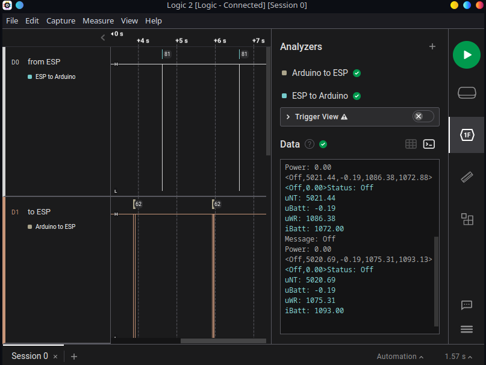

# Please see this [branch](https://github.com/PaulusElektrus/energy_cube/tree/Old_Prototype_RaspberryPi) for old Raspberry development!

---------------------------------------------------------------------------------------------------------

# Repository is NOT up to date!

See [here](https://github.com/PaulusElektrus/EnergyCube-Arduino) for Arduino Code and [here](https://github.com/PaulusElektrus/EnergyCube-ESP) for ESP Code.

## Energiewürfel

## Masterarbeit Smart-Home Batteriespeicher für Balkonkraftwerke

- ### Architektur

    Es wird ein Kombiboard aus einem Arduino Uno und einem ESP8266 benutzt

    - Arduino (Arduino_Code)

        Der Arduino übernimmt die Steuerung der Hardware

    - ESP8266 (ESP_code)

        Der ESP8266 mit seinem W-LAN Modul übernimmt die Kommunikation mit dem Internet

- ### Kommunikation

    Die Kommunikation zwischen den Mikrocontrollern erfolgt über UART. 

    Ein Screenshot des Logic Analyzers welchen ich zur Überwachung der Kommunikation benutze:

    

    Man erkennt in den < > geschweiften Klammern die jeweils übertragene Nachricht und danach als Empfangsbestätigung, Debug und zu Demonstrationszwecken die Ausgabe des jeweiligen Mikrocontrollers in schönem Format mit richtigem Dateiformat.

- ### Weitere Informationen folgen...
